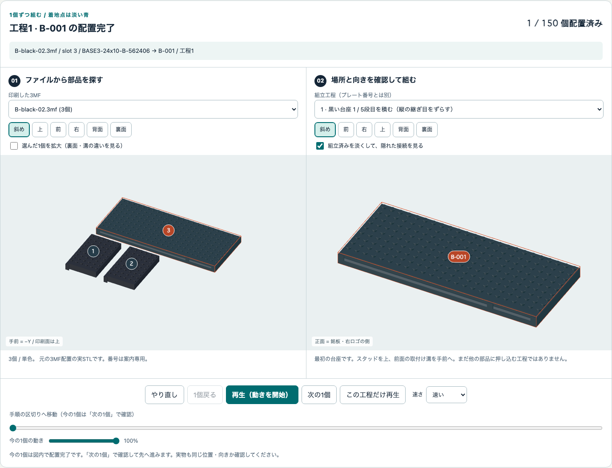
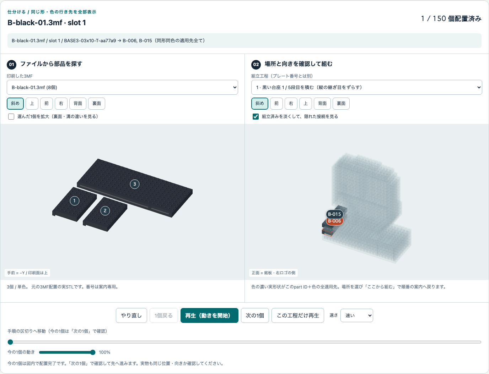
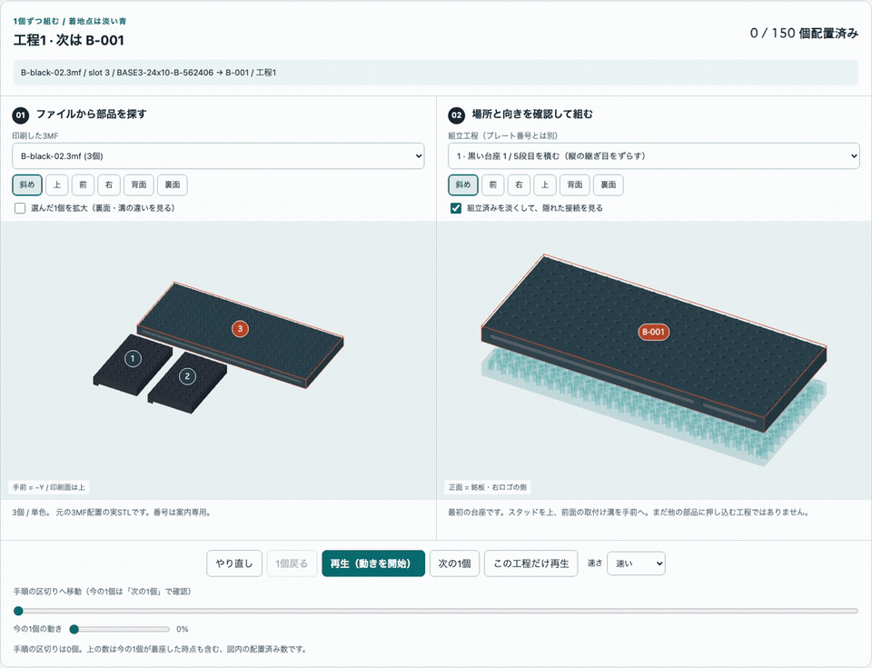

# 印刷した部品を、どこから・どう組む？

**[A / B / C の対話3Dガイドを開く](../site/assembly-guide/index.html)**

印刷するファイルの順番と、組み立てる順番は違います。
色別プレートは効率よく並べた**印刷用の配置**で、ファイル末尾の `01` は台座の1段目という意味ではありません。
このガイドは、実際に配布しているSTL・3MF配置・組立番号を結び、1個ずつ取り出して載せるためのものです。

| 印刷した案 | 3Dで仕分け・組立 | オフライン版 | 最初に取り出す部品 |
| --- | --- | --- | --- |
| A | [Aの3Dガイド](../site/assembly-guide/A.html) | [A ZIP](../site/assembly-guide/A-offline.zip) | `A-black-02.3mf` のslot 3 → `A-001` |
| B | [Bの3Dガイド](../site/assembly-guide/B.html) | [B ZIP](../site/assembly-guide/B-offline.zip) | `B-black-02.3mf` のslot 3 → `B-001` |
| C | [Cの3Dガイド](../site/assembly-guide/C.html) | [C ZIP](../site/assembly-guide/C-offline.zip) | `C-black-04.3mf` のslot 2 → `C-001` |

オフラインZIPを展開して `index.html` をダブルクリックします。ローカルサーバー、CDN、ログイン、ネット接続は不要です。
Chrome / Edge / Firefox / Safariの現行版を使ってください。
オフラインZIPは閲覧用です。印刷STL・3MFは[別PCでの印刷手順](build.ja.md#print-another-pc)から保存します。
別の案を混ぜないでください。公開の文字は実形状でも `YOUR-USERNAME` の汎用表示です。

## Bを印刷した方へ：最初の1段

`B-black-02.3mf` には3個あります。大きな1枚、**slot 3 / `BASE3-24x10-B-562406`** が
唯一の `B-001` です。スタッドを上、前面の取付け溝を手前へ置きます。
下図の左が元の印刷配置、右が組立側です。番号は案内用で、実物に刻印されていません。

**`B-black-01` を刷り終えただけでは、1段目はありません。**
その中には2〜5段目に使う溝・端の部品が入っています。違う形なのに、無理に1段目のように並べないでください。

台座の全5段を揃えるには、Bの黒 **01・02・03・04** の対象部品が必要です。
同形同色の `BASE3-06x10-T-838259` は6個あり、黒03に4個、黒04に2個入っています。
黒04の2個を忘れないでください。便宜上は5段目の `B-016` / `B-017` に割り当てていますが、
同じID・同じ色の6個の間では交換できます。

## 3Dガイドの使い方

1. **刷ったファイルを選ぶ。** 左の「印刷した3MF」で、保存したファイル名と一致するものを選びます。
   実プレートの形・位置とslot番号が出ます。Bambu Studioで再配置した場合、この番号はその新しい表示順ではありません。
2. **実物を見比べる。** 図内の番号か、下のslotボタンで選びます。part ID・寸法・必要個数を確認します。
   「選んだ1個を拡大」→「裏面」「背面」を使い、下面空洞・溝・端の形を確認します。
   同じ外形寸法でも溝の異なる台座部品があります。寸法だけで同一品と判断しません。
3. **使える場所を全部見る。** 右側では同じpart ID＋同じ色の全候補が濃く表示されます。
   「使える組立場所」から番号を選ぶと位置が分かり、「ここから組む」でその直前まで組み上がった状態へ移れます。
   別の場所から開始する場合は、前の工程が実物でも揃っていることを確認してください。
4. **空の机から順番に。** 「やり直し」または工程0は空の状態です。「最初の1個」から、
   「次の1個」「1個戻る」、再生／一時停止、「この工程だけ再生」で進みます。
   動いている部品の **3MF名・slot・part ID・組立番号・工程** が、常に図の上に表示されます。
5. **接続を見たい時は淡く。** 「組立済みを淡くする」を入れると隠れた位置が見えます。
   色や完成状態を確認する時は外します。前・右・上のボタン、ドラッグ、ズームでも見られます。

「便宜割当」は仕分けのために安定させた例です。同じ形・同じ色の部品に固有のシリアル番号はありません。
その1個だけの行き先とは断定せず、**全ての取り出し元と全ての適用先**を並べています。
異なるpart ID・異なる色を混ぜたり、必要数を減らしたりしてよいという意味ではありません。

## 台座5段 → 銘板と右ロゴ → keeper

下の短いアニメは、Bの最初の24個（工程1〜7）を実STLから表示しています。
各フレームにファイル名・slot・部品・組立番号を付けています。説明用3DCGで、Blenderの再レンダーや物理試験ではありません。

[一時停止できるMP4を保存](../site/assembly-guide/media/B-first-seven-steps.mp4)。
細かい動きは[対話3Dガイド](../site/assembly-guide/B.html)の工程6・7でゆっくり再生してください。

銘板と右ロゴは印刷時には平らです。表面を正面へ90°起こし、**keeperを付ける前に、溝の上から**差し込みます。
前から押し込む組み方ではありません。両方が着座してから、銘板用2個・ロゴ用1個のkeeperを載せます。
その後、顔の1段目から頭頂までを同じガイドで進めます。Bは全150個で、試験片は別です。

取り外しは逆の順です。keeperを上へ6 mm、前へ32 mm以上離して脇へ置き、
対象モジュールを45 mm以上上抜きしてから手前へ。接着剤は不要です。
これらは設計上の案内寸法であり、実物で強く引いてよいという意味ではありません。

## 印刷・実物確認の境界は変わりません

**NOT_SLICED。実物の嵌合、keeper保持、強度、転倒は未試験です。**
先にFIT、NP3-FIT、[7個の少量試作](trial.ja.md)。7個の成功は完成品全体の保持合格ではありません。
穴の閉塞・白化・つかみにくさ・着座不良・強い力が必要なら、全数印刷と組立を止めます。
無理押し、打撃、穴を全て削って合わせることを完成キットの前提にしません。

黒・シアン・マゼンタ・緑は単色。文字と右ロゴは黒地一体レリーフなので、白い独立小片ではありません。
黒支持体の境界は文字2.4 mm、ロゴ2.8 mm。実レイヤープレビューで、最初の白い経路の直前にPauseを入れます。
汎用3MFにPause、実P1Sプロファイル、G-codeは入っていません。
