# 制作記録 — Bの台座から完成まで

**2026-09-25、個人向けBが完成しました。**
本人から「これで完成ですね」という言葉と、ゴーグルの上枠・紫の頭頂まで揃った全体写真が届きました。
台座から一段ずつ積み上げてきた制作過程と、完成した姿をここに残します。
公開画像は識別情報を伏せています。

**最新報告日：2026-09-25。個人向けB版の制作例です。**
この記録は、ユーザー本人から届いた進捗報告と実物写真をまとめたものです。
CGの完成図ではなく、台座・前面部品、顔下部、ゴーグルを経て完成に至った実物の記録です。

[09/25：ゴーグルを積み上げ、完成へ](#build-2026-09-25) ／
[09/24：顔下部の途中記録](#build-2026-09-24) ／ [09/23：台座と前面部品の記録](#build-2026-09-23)

銘板の個人向け表示と周辺の識別情報は、公開用の画像そのものから除去しています。
公開モデルの仮文字 `USER` を実写真へ合成してはいません。測定や版の照合とは異なる点は、
末尾の[写真観察と検証の境界](#evidence-boundary)にまとめています。

## 本人の報告と、ここまでの学び

| 報告・設計記録 | 分かったこと | まだ分からないこと |
| --- | --- | --- |
| 09/22：文字が小さく、孔・開口・字間が狭く印刷しにくいという報告。ノズルは本人申告で0.2 mm | 文字形状を見直す具体的な課題が得られた | 糸引き・上面荒れの原因を温度・flow・材料などへ断定できない |
| その後：2行を維持し、孔・字間・下段の文字高・白文字の厚みを改訂 | 公開版5.0のCAD上の変更と実測値は[文字改訂の記録](lettering.ja.md)で確認できる | 写真の現物がどのSTLハッシュ・スライサー設定を使ったかは未照合 |
| 09/23 12:09：「いけているみたい」と銘板2枚の写真を提供 | 本人から改善感の報告があった | 2枚の旧版／新版の対応や、どちらが合格したかを断定しない |
| 09/23 12:18：「土台が組み上がりました」と制作写真7枚を提供 | 個人向けBの台座と前面モジュールの制作が進んだ | 顔・ゴーグルを含む完成全体、保持力・転倒・耐久性は確認できない |
| 09/24 22:27：「こちらは組み立ての途中記録になります」と写真7枚を提供 | 台座・前面部品の上に顔下部を積む途中の進捗報告 | 正確なCAD工程・撮影順、上部ゴーグル・頭頂の完成、周囲の黒い板状物の用途は未確認 |
| 09/25 21:44：「制作過程の写真です」と写真8枚を提供し、続いて「これで完成ですね」と報告 | ゴーグル上枠・紫の頭頂・銘板・右ロゴが揃った、個人向けBの完成報告と完成写真 | 使用STLや実設定との照合、測定による保持力・強度は別途 |

上の時刻は**報告時刻**です。写真ごとの正確な製作・撮影時刻ではありません。
09/23に届いた写真の元ファイル日付は09/22・09/23が混在し、時系列を確定できません。
09/24・09/25の写真も、添付順やファイル名から製作・撮影時刻を推定しません。
以下の番号は**説明する順番**であり、製作順・撮影順・CAD工程番号ではありません。
同じ段階を別角度から写した写真を、別々の工程として数えません。

## 2026-09-25 — ゴーグルを積み上げ、完成へ

「制作過程の写真です」と届いた8枚には、シアンのゴーグルを積み上げる途中と、最後の全体姿が写っています。
続く本人の「これで完成ですね」という報告と合わせ、**個人向けBの完成報告と完成写真**として記録します。
以下は見える変化をまとめた説明順です。8枚をそのまま8つのCAD工程や撮影時刻へ対応付けてはいません。
[完成写真を先に見る](#completed-portrait-2026-09-25)こともできます。

### 09/25・01 — シアンの下縁と端を積む

[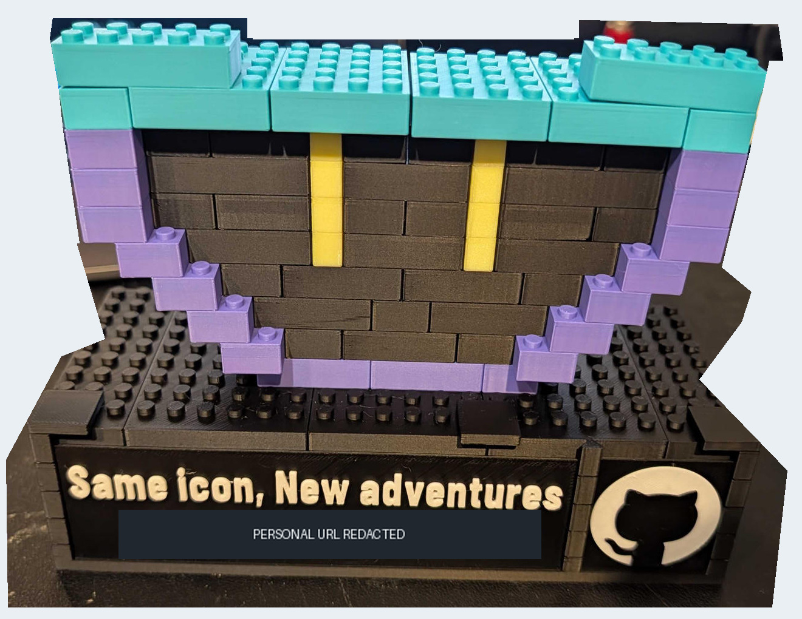](../site/media/build-log/2026-09-25/goggle-lower-band.jpg)

**09/25・写真01。** 黄色い縦2列のある顔下部の上へ、シアンの下縁が横に渡っています。
両端にはその上のブロックも載り、大きなゴーグルの輪郭が見え始めました。

### 09/25・02 — 黒い左右の面と中央のシアンが高くなる

[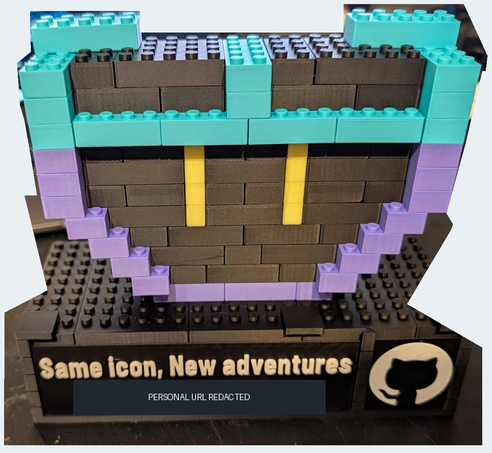](../site/media/build-log/2026-09-25/goggle-growing.jpg)

**09/25・写真02。** 左右の黒い面を、シアンの外周と中央の列が区切っています。
下部の紫の輪郭からゴーグルへつながり、顔全体の印象がはっきりしてきたところです。

### 09/25・03 — 上側が開いたゴーグル枠

[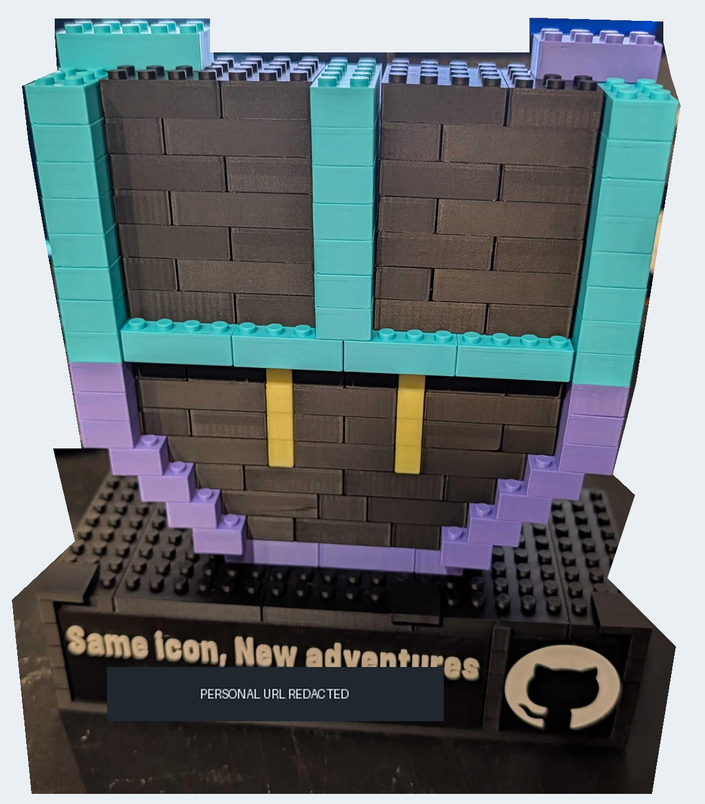](../site/media/build-log/2026-09-25/goggle-before-closure.jpg)

**09/25・写真03。** ゴーグルの高さが増し、上部を仕上げる前の状態です。
上側の開いている部分や、上面のスタッドが見えます。

### 09/25・04 — 上枠と紫の頭頂まで揃い、完成

[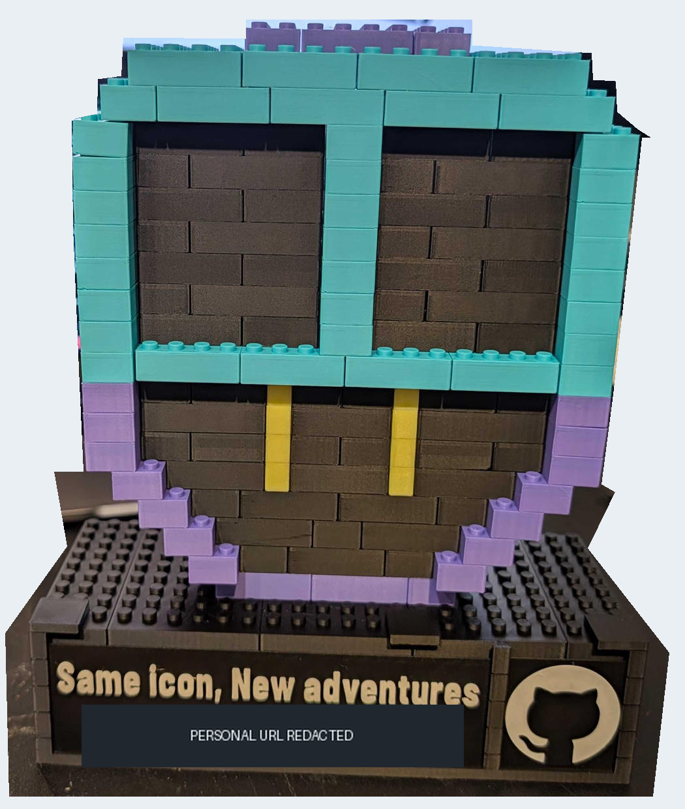](../site/media/build-log/2026-09-25/finished-portrait.jpg)

**09/25・写真04。完成です。** ゴーグルの上枠が閉じ、紫の頭頂も揃いました。
黒い顔、シアンのゴーグル、紫の輪郭、黄色い縦2列、そして台座の銘板と右ロゴまで、全体の姿が写っています。
本人から届いた言葉は**「これで完成ですね」**。台座から積み上げてきた個人向けBの完成を、この写真とともに記録します。

### 09/25・補足 — 組立途中を別角度から

[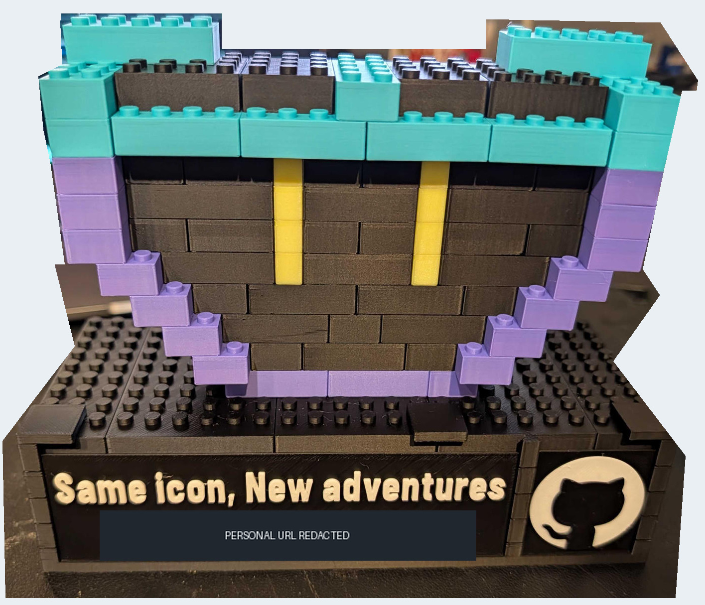](../site/media/build-log/2026-09-25/goggle-first-row.jpg)

**09/25・写真05。** 下縁と端のシアン、中央列、黒い左右の面を写した途中の見本です。

[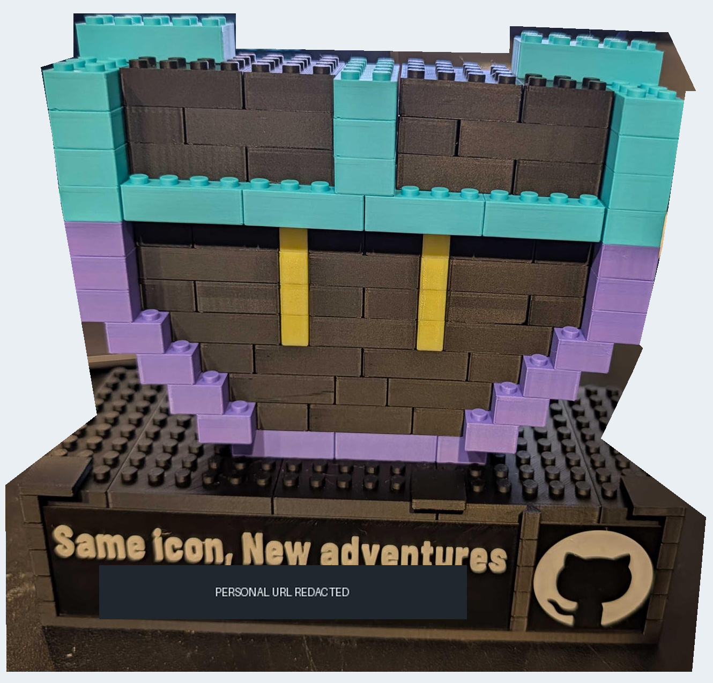](../site/media/build-log/2026-09-25/goggle-midway.jpg)

**09/25・写真06。** ゴーグルの縁と黒い面が見える別角度です。近い状態を補足する写真として残しています。

[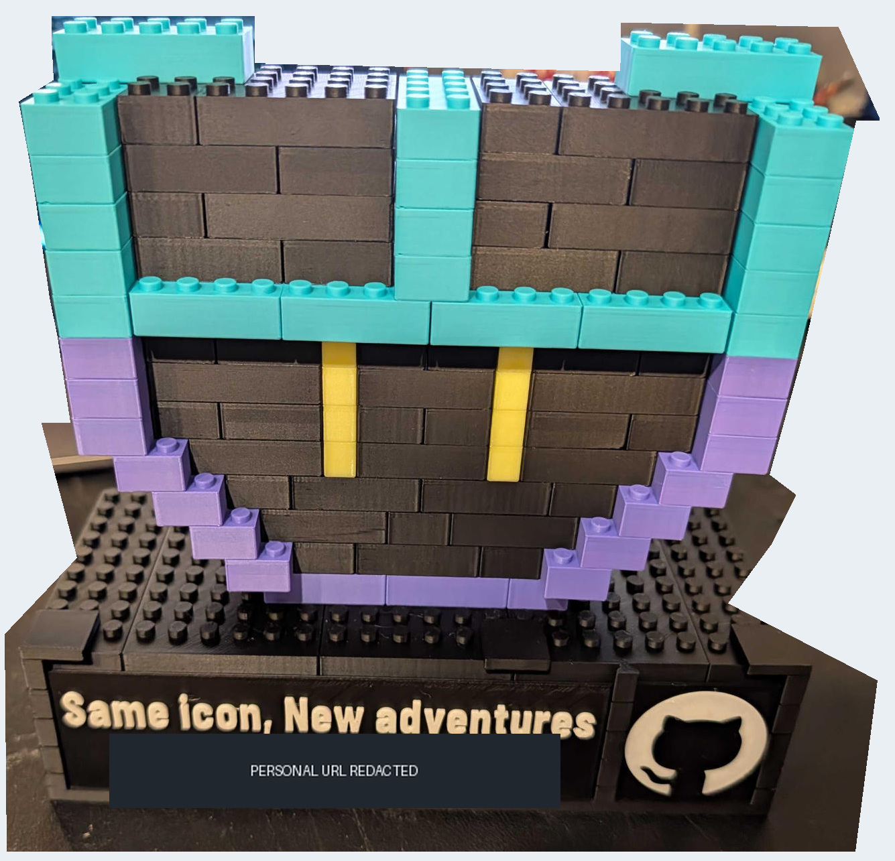](../site/media/build-log/2026-09-25/goggle-higher.jpg)

**09/25・写真07。** 黒い面と中央列の高さが増し、上枠を閉じる前の輪郭がよく分かります。

[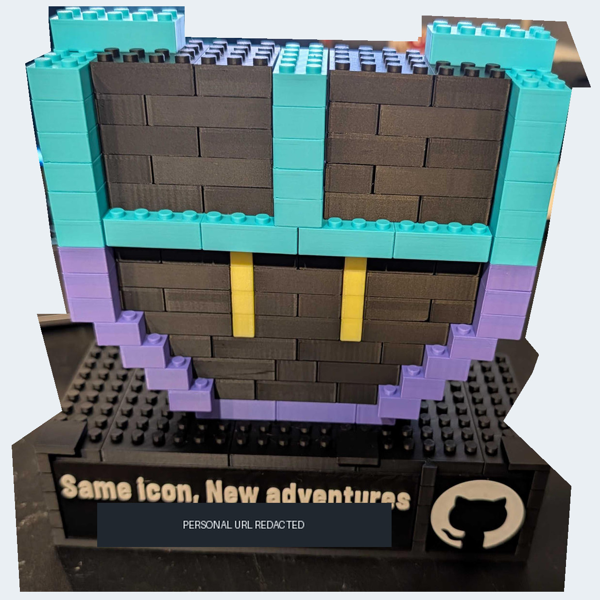](../site/media/build-log/2026-09-25/goggle-near-top.jpg)

**09/25・写真08。** 頭頂を仕上げる前の姿を別に記録したものです。補足写真の並びを撮影順としては扱っていません。

実物の紫・黄は、これまでの制作例と同じ実制作の配色です。公開設計のmagenta／greenを変更せず、
写真を塗り替えたり、写っていない部品をCGで補ったりしていません。
9/23・9/24の「まだ写っていない」という説明は、その報告時点の記録として以下に残しています。

### 印刷後の後処理：超音波洗浄（ユーザー提供動画）

**3Dプリント後のパーツを超音波洗浄｜Ultrasonic Cleaning of 3D-Printed Parts**

<iframe src="https://www.youtube-nocookie.com/embed/Lc_enNE3nng?playsinline=1" title="3Dプリント後のパーツを超音波洗浄｜Ultrasonic Cleaning of 3D-Printed Parts" style="display:block;width:100%;height:100%;border:0" loading="lazy" referrerpolicy="strict-origin-when-cross-origin" allow="encrypted-media; picture-in-picture; fullscreen" allowfullscreen></iframe>

ユーザーから「3D Print後の超音波洗浄」として紹介された制作の参考動画です。
上の公式YouTubeプレーヤーの▶を押すと、このページ内で再生できます。自動再生はしません。
**この動画欄はオンライン限定です。** プライバシー強化モードでもYouTubeへの第三者通信は発生します。
動画・音声・サムネイルをこのrepoへ保存・再アップロードしてはいません。
写真・3Dガイドのオフライン配布は従来どおり利用できますが、`file://`では動画の参照元制約により再生できない場合があります。
その場合は[この小節のWeb版を開いてください](https://ktanino10.github.io/copilot-brick-display/build-log.html#post-print-cleaning)。

再生できない場合の補助リンク：[YouTubeで見る](https://youtu.be/Lc_enNE3nng)。
タイトルは公開メタデータで確認していますが、本編の機器・洗浄液・温度・時間・効果は未確認です。
本制作の必須工程や、安全検証済みの手順としては案内していません。

## 2026-09-24 — 顔下部を組み立てる途中

本人の言葉は「こちらは組み立ての途中記録になります」です。
台座と前面部品の上に顔下部が加わった、**組立途中**の記録として掲載します。
主に見える状態を四つに分け、同じ状態の別角度は補足へまとめます。
**以下の四段階は説明上の整理で、CADの工程番号や添付・撮影の時系列ではありません。**

写真で見える**紫・黄は実制作例の配色**です。公開設計のmagenta／greenとは区別し、
この記録を配色の再設計依頼とは扱いません。公開のSTL・BOM・色指定・全配置は変更していません。

### 09/24・01 — 台座の上に低い紫のブロック列

[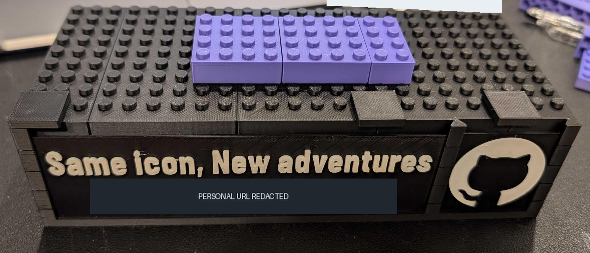](../site/media/build-log/2026-09-24/first-purple-row.jpg)

**09/24・写真01。** 台座と前面部品の上に、低い紫色のブロックが横に並んでいます。
この写真をCADの特定の工程番号へ対応付けたり、実物の個数・寸法・着座状態を測定したりした記録ではありません。

### 09/24・02 — 黒い層と段付きの左右輪郭

[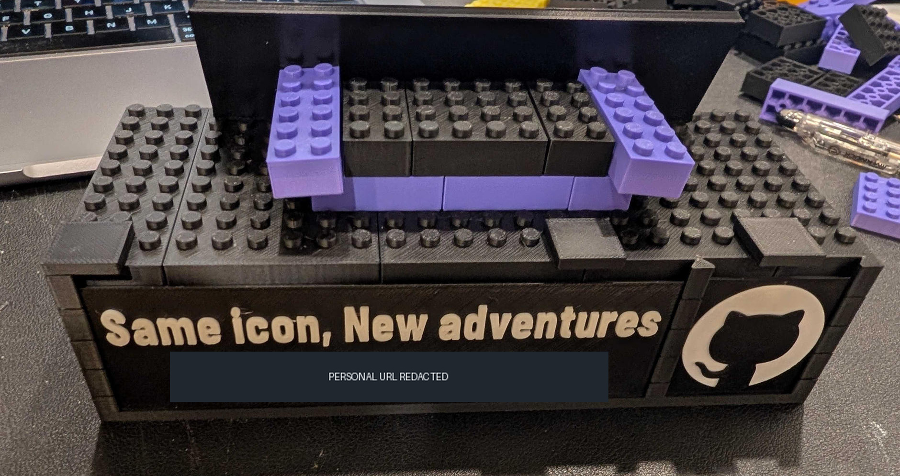](../site/media/build-log/2026-09-24/lower-face.jpg)

**09/24・写真02。** 黒いブロックの層と、左右に段差を持つ紫色の輪郭が見えます。
背面の黒い板状物は写っているものの、製品の部品・固定具・補強のどれなのかは確認されていません。

### 09/24・03 — 黄色い縦2列が見える顔下部

[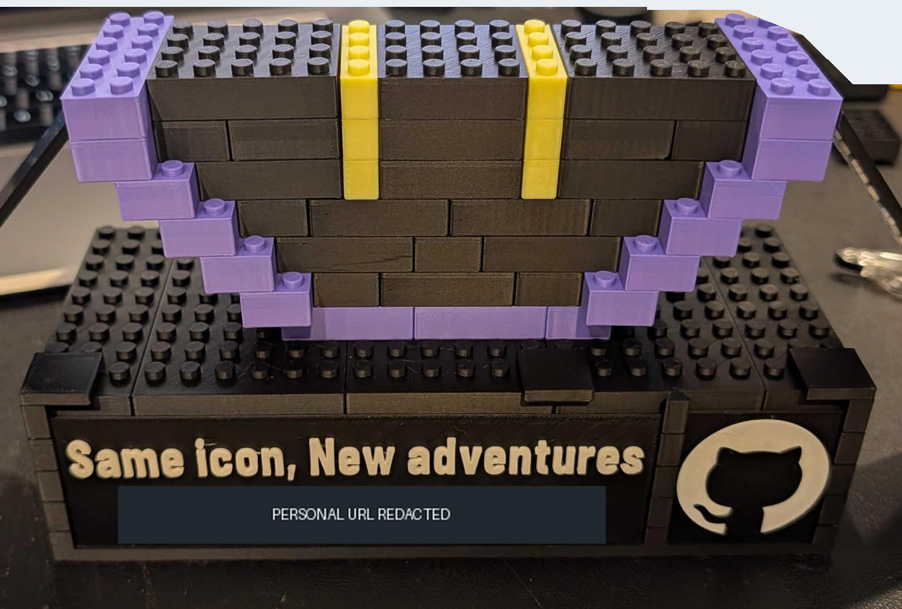](../site/media/build-log/2026-09-24/face-eye-strips.jpg)

**09/24・写真03。** 黒い面の中に黄色い縦2列が見えます。紫・黄は写真の実制作例の色として記録しています。
公開設計のmagenta／greenを更新したり、写真の色で公開STLやBOMを置き換えたりはしていません。

### 09/24・04 — 上側に黒い列が加わった状態

[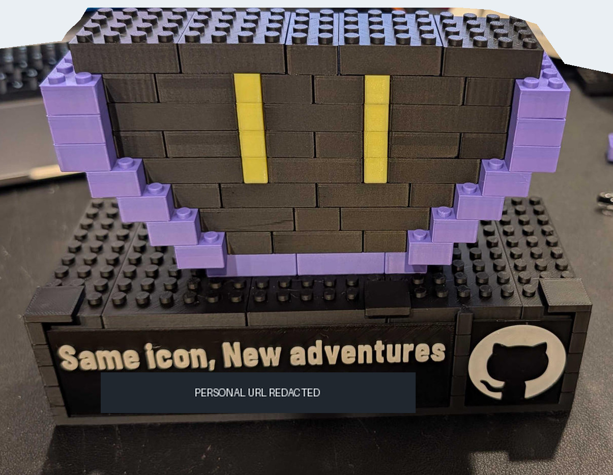](../site/media/build-log/2026-09-24/face-top-row.jpg)

**09/24・写真04。** 縦2列の上側に黒い横列があり、顔下部の範囲が広がった途中の状態が見えます。
上部ゴーグル・頭頂はまだ付いていない段階として扱い、完成全体や強度の確認写真とは呼びません。

### 09/24・補足 — 別角度で見る同じ途中段階

[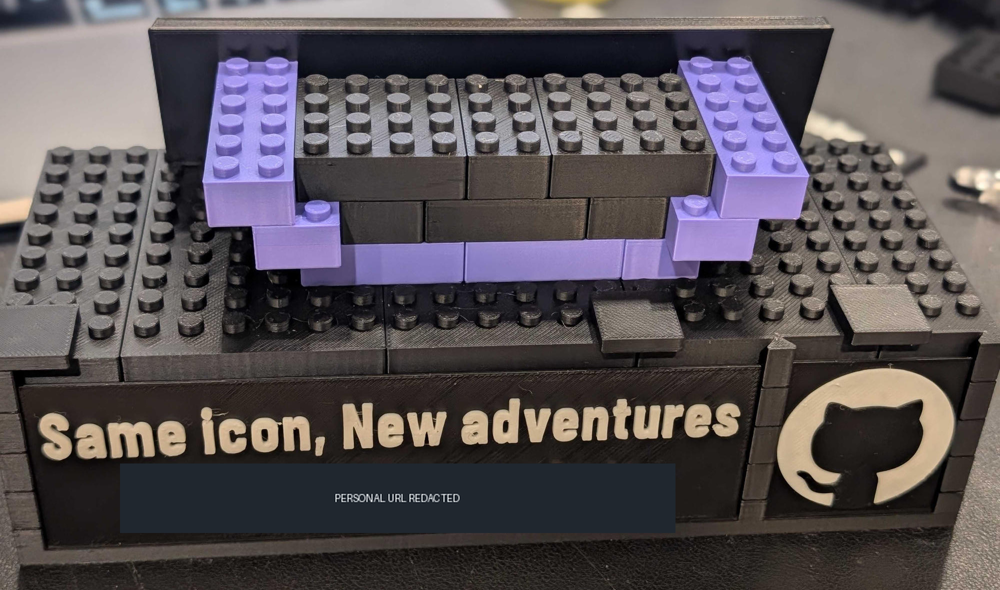](../site/media/build-log/2026-09-24/lower-face-detail.jpg)

**09/24・写真05。** 黒い層と紫色の左右輪郭を近くから写した補足です。写真02から新たな工程が増えたとは断定しません。

[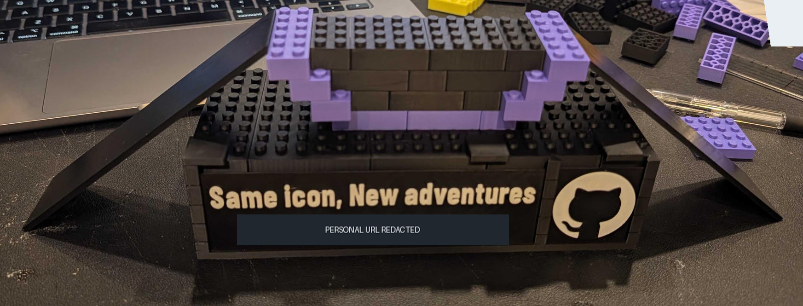](../site/media/build-log/2026-09-24/lower-face-wide.jpg)

**09/24・写真06。** 顔下部と周辺が見える別角度です。左右の板状物が何を支えているか、何のために置かれたかは推測しません。

[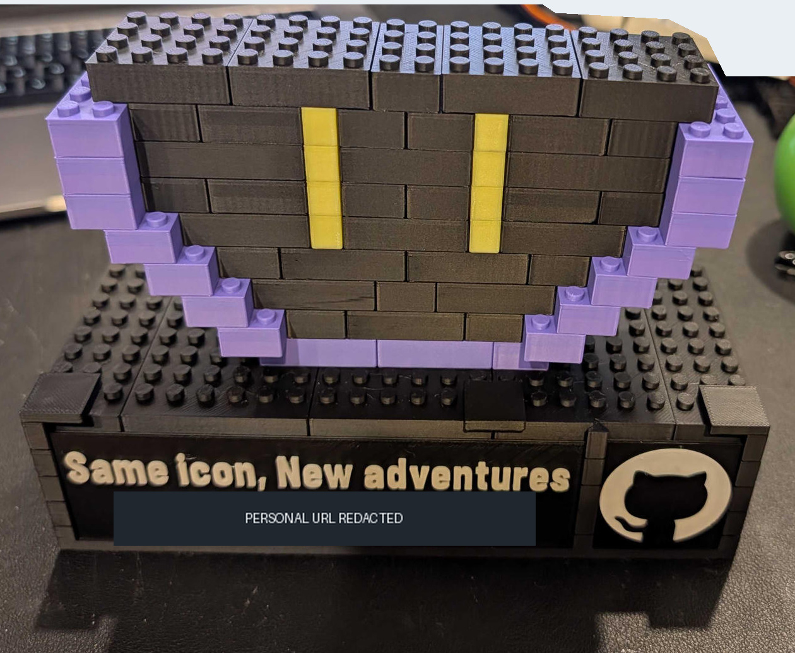](../site/media/build-log/2026-09-24/face-top-row-angle.jpg)

**09/24・写真07。** 写真04に近い途中状態を別角度で示しています。番号は説明順で、撮影時刻やCAD工程番号ではありません。

背面や左右に立てたり斜めに置かれたりした**黒い板状物の用途は未確認**です。
保持具・必須部品・補強材・失敗対策とは断定しません。写真から隠れた部品や接続を補っていません。
この段階では顔下部の途中写真があり、上部ゴーグル・頭頂の完成は未確認です。
顔全体や全150部品の完成、強度・荷重・保持力を示す記録ではありません。

## 2026-09-23 — 台座と前面モジュール

以下は前回の9枚です。写真と当時の報告を残し、09/24の進捗と混同しないよう日付を分けています。

### 01 — 文字の隙間・印刷しやすさの相談

[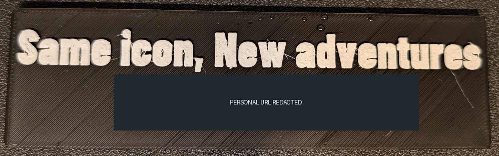](../site/media/build-log/2026-09-23/lettering-first.jpg)

**写真01／報告日09/22。** 白い主文の字間に糸状のものや、文字表面の荒れが見えます。
本人の「小さい・隙間が狭い」という相談の記録であり、写真から最小孔径や温度・flowを測定・推定したものではありません。
下段の帯は掲載時のプライバシー処理で、造形物の一部ではありません。

### 02 — 調整・再試作についての追加報告

[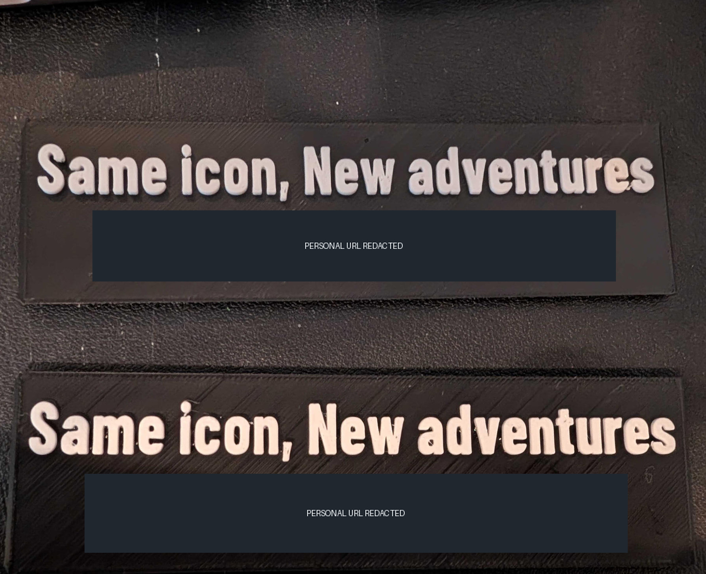](../site/media/build-log/2026-09-23/lettering-follow-up.jpg)

**写真02／報告日09/23。** 銘板2枚を並べた写真と「いけているみたい」という本人の言葉が届きました。
各板がどの印刷ファイル・条件に対応するかは未照合です。**上が旧版・下が新版などとは断定しません。**
孔や字間を改善した設計の数値は、[公開版5.0のCAD記録](lettering.ja.md)へ分けて記載しています。

### 03 — 前面が空の黒い台座

**写真03／報告日09/23。** 台座の上面スタッド、ブロックの継ぎ目、前面の二つの取付け領域が見えます。
全5段を下から順に撮影した連続記録ではなく、部品数・段数・寸法の実測記録でもありません。

### 04 — 右ロゴを取り付けた状態

**写真04／報告日09/23。** 右ロゴが装着され、左の銘板を入れる領域が空いています。
写真で見える装着状態を示すもので、保持力、着脱回数、向きや色の設計との完全一致を認定しません。

### 05 — 銘板と右ロゴが付いた土台

[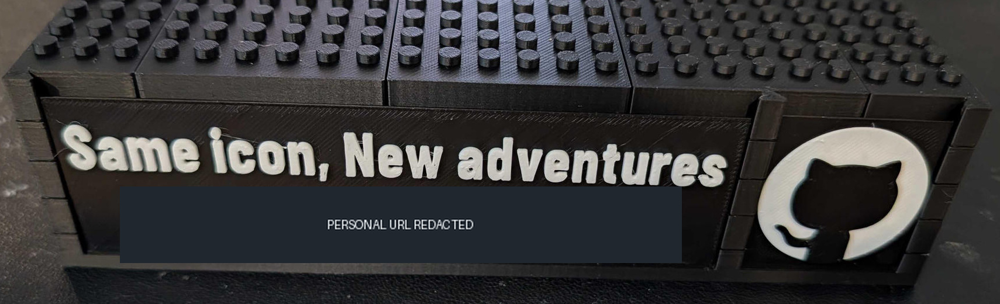](../site/media/build-log/2026-09-23/front-modules-installed.jpg)

**写真05／報告日09/23。** 「土台が組み上がりました」という報告とともに、
台座に銘板・右ロゴが取り付けられた状態が確認できました。顔・ゴーグルの完成全体は、この写真には写っていません。
個人行を覆った帯の下へ公開の仮文字を合成しておらず、公開版 `USER` を印刷済みと示す写真ではありません。

### 補足ギャラリー — 同じ台座を別角度から

以下は積層・継ぎ目・前面領域の見え方を補う写真です。**別々の新しい工程ではありません。**
写真番号は説明順のみで、製作・撮影の順番を保証しません。

[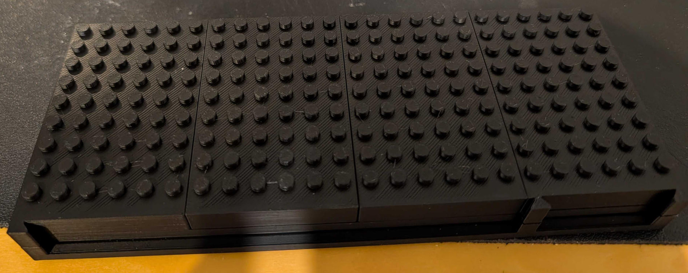](../site/media/build-log/2026-09-23/base-top-angle.jpg)

**写真06。** 上面のスタッドとブロックの継ぎ目が分かる角度。寸法を画像から割り出してはいません。

[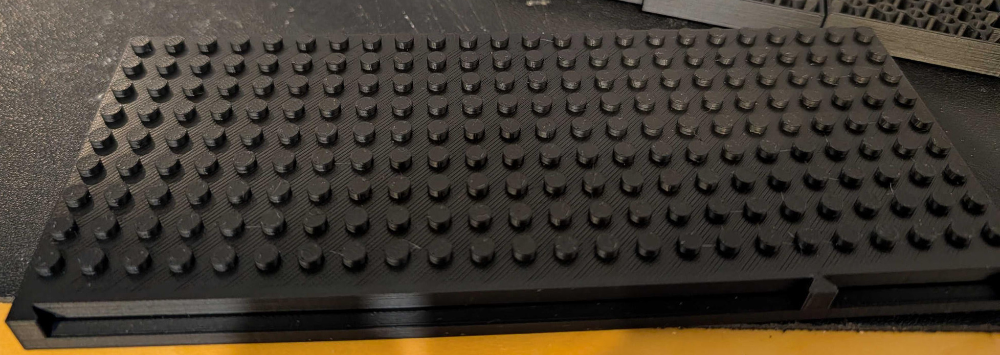](../site/media/build-log/2026-09-23/base-side-angle.jpg)

**写真07。** 同じ台座の別角度。未撮影の組立操作を補ったCGではありません。

[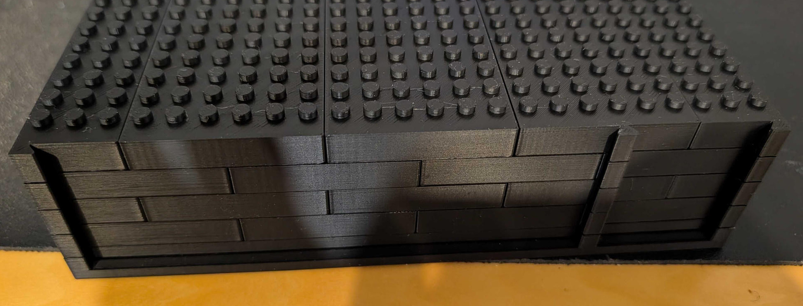](../site/media/build-log/2026-09-23/base-front-detail.jpg)

**写真08。** 前面の継ぎ目と取付け領域。写真から実際のクリアランス値は算定しません。

**写真09。** 前面パーツを入れる前の全景です。写真03と同じ段階の補足であり、工程が一つ増えたという意味ではありません。

## 写真観察と検証の境界

本人の完成報告と全体写真により、**個人向けBの完成**を記録しました。
使用STLハッシュと実preset・設定入り`.3mf`は未照合です。写真は全150部品の個別照合や、測定されたkeeper保持力・荷重・強度・転倒・寿命、
量産・玩具認証を示すものではありません。公開の汎用文字版・A/Cの実物成功へも広げません。
公開版5.0のデジタル検証と`NOT_SLICED`の区分はそのままで、写真だけで物理試験を合格に変更していません。
周辺の黒い板状物の用途も未確認のままです。

次に作る方は[印刷手順](build.ja.md#print-another-pc)の少量試作から進め、個人情報を含む実設定や原写真は公開Issueへ置かないでください。

## これから作る方へ

同じ形を組むときに必要な場所・部品は、[Bの対話3D組立ガイド](../site/assembly-guide/B.html)で確認できます。
写真番号ではなく、実際にできているところに対応する**組立工程**を選びます。
この記録のために印刷マスター、STL／3MF、CAD、BOM、既存動画を変更していません。

[別PC・色別印刷の手順](build.ja.md#print-another-pc) ／ [仕分けと1個ずつの組立](assembly.ja.md) ／
[文字の小試験片と測定値](lettering.ja.md)

## 写真の利用範囲

公開画像は、09/23の9枚、09/24の7枚、09/25の8枚、計24枚です。
09/23の9枚とそのハッシュ、寸法、報告日、加工内容は[09/23の公開画像manifest](../site/media/build-log/2026-09-23/manifest.json)に記録しています。
09/24の7枚は[09/24の公開画像manifest](../site/media/build-log/2026-09-24/manifest.json)に分け、撮影日時は未確定のままです。
09/25の8枚も[09/25の公開画像manifest](../site/media/build-log/2026-09-25/manifest.json)にハッシュ・寸法・報告日・加工範囲を記録し、撮影日時は未確定にしています。
前回分は向きの補正・対象物への切り抜き・メタデータ除去を行い、個人行が写る3画像の計4箇所には、
「PERSONAL URL REDACTED」と書いた不透明帯を**画像の画素へ焼き込み**ました。
09/24分も全7枚の個人行を不透明画素で伏せ、背景のPC画面・別の文字板・包装ラベルなどの該当箇所を
切り抜き、または薄いグレーの不透明画素で除去しています。残っているキーボード・机・部品・黒い板状物から、その用途を推定しません。
09/25分は作品周辺の背景を薄いグレーの不透明画素へ置き換え、全8枚の個人行を暗い不透明帯で覆っています。
切り抜きと背景処理の境界は画像に見える状態です。一部の帯が主文下端に少しかかるのは識別情報を確実に伏せる余白であり、造形の欠けではありません。
**背景マスクは識別情報を除くためで、作品の造形補修ではありません。**
CSSの覆いや半透明・ぼかしではなく、配布JPEGとそのまま開けるリンク先も同じ処理済み画像です。
糸引き、表面の荒れ、隙間を隠す造形上のレタッチや、写っていない部品を補う合成はしていません。

写真は、ユーザーが**一般向け・個人向けの両repoでの制作記録への掲載**を承認したものです。
公開するのは識別情報を伏せた派生画像だけで、未加工写真・個人URL・撮影位置・EXIF・元ファイル名は含めません。
モデルやライブラリのライセンスが写真へ自動適用されるわけではなく、**CC0化や第三者への再配布許諾を意味しません**。
写真の権利は権利者に留保されます。再利用は権利者へ確認してください。MakerWorldや別のSNSへの掲載許可でもありません。
