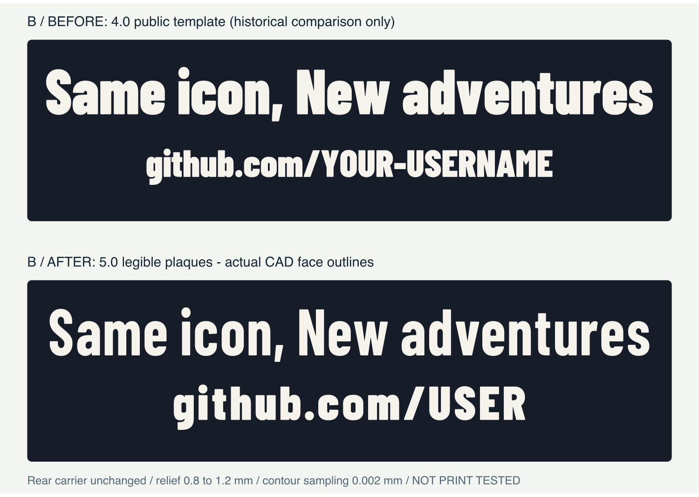

# 銘板の印刷しやすさ — 5.0改訂と小試験片

**公開版の2行は `Same icon, New adventures` / `github.com/USER` です。**
`USER`は短い仮表記であり、実在の人やプロフィールへのリンクではありません。
長い仮文字列を無理に細く収めるのでなく、短い公開例にすることをユーザーが選択しました。
個人向け入力の文言をこの仮表記へ変更する仕組みではありません。

0.2 mmノズルでの試作から「文字が小さい・孔や字間が狭い」というフィードバックを受けた設計候補です。
**この改訂を実機印刷して合格した証拠はまだありません。**
09/23には個人向けBで本人の改善感と台座・前面部品の写真報告が届き、[制作記録](build-log.ja.md)へ追加しました。
現物に使ったファイル・設定の版は未照合なので、この公開版の実物合格とは扱いません。
糸引きや上面の荒れの原因を写真だけで温度・flow等へ断定していません。
未加工の原写真は載せず、許可された制作記録用の識別情報除去済み画像だけを別ページで示します。

## 変えたもの・変えないもの

主文はBarlow Condensed **Bold**、下段は**Black**です。主文の文字高はA10 / B12 / C14.5 mmを維持し、
URLは全案10 mmへ均等拡大しました。元のkerningを保ち、不足する字間だけを追加します。
閉じた孔の内側と`e`の右出口を広げ、白い文字の高さを0.8→**1.2 mm**にしました。
全行の横圧縮、文字の切捨て、3行化はしていません。

黒い支持体は**2.4 mmのまま**、銘板全厚は**3.6 mm**。各案の裏面・キー溝取付け・顔・台座・右ロゴ・68非文字STLは不変更です。
文字が0.4 mm前へ出た分、完成奥行きはA64.2 / B80.2 / C112.2 mmになりました。
幅・高さ・全配置・組込個数91 / 150 / 228は維持しています。右ロゴの白レリーフは0.8 mmのままです。

上図は保存済みCADの実面輪郭から作成しています。旧4.0の長い仮表示は**歴史的な比較用**で、印刷用データではありません。
元の旧版はGitの版履歴で区別し、現在のダウンロードには新旧の銘板を混在させません。

## 文字列ごとの実測

| 案・行 | 実文字高 | 実インク幅 / 上限 | 最小字間 | 平行な正の直線幅 | 持続的な材料neck指標 |
| --- | ---: | ---: | ---: | ---: | ---: |
| A 主文 | 10 mm | 93.638 / 94 mm | 0.796 mm | 1.196 mm | 0.85 mm |
| B 主文 | 12 mm | 132.130 / 134 mm | 1.048 mm | 1.261 mm | 1.09 mm |
| C 主文 | 14.5 mm | 167.331 / 174 mm | 1.048 mm | 1.524 mm | 1.34 mm |
| 全案 URL | 10 mm | 77.423 / 各案上限 | 1.048 mm | 1.689 mm | 1.17 mm |

Aの主文は狭い102 mm支持体に収めるため、孔の中央帯目標0.90 mm、`e`出口0.95 mm、字間0.80 mmを明示的に使用します。
B/C主文と全案のURLは孔1.02 mm、`e`出口1.10 mm、字間1.05 mmの目標です。
**A主文を全字1 mm以上と称していません。** 小型の幅を守った選択で、Aの文字試験片を別に確認します。

測定定義はそれぞれ別です。

- **閉counter**：孔の高さ・幅の中央25–75%帯に、それぞれ101本置いた横・縦chordの最小値。
  最大内接円の直径とは異なり、鋭い三角孔の全先端幅を保証しません。
- **c/eの開口**：0.01 mm格子で内側から外へ抜ける経路を測る近似。誤差は約±0.03 mm。
- **字間**：最終BRepの隣接する字形間の実距離。0.002 mm輪郭samplingによる計画値とは最大0.006 mm差を許容し、表は実値です。
- **正の材料**：平行直線の幅と、侵食した時に0.05 mm²以上の2領域へ分裂する最初の幅（半径0.005 mm刻み）を別々に報告。
  全ての曲線先端やスライサーの線幅を保証する値ではありません。

孔を広げても材料が細くなる文字は停止対象です。長い別handleや大文字を入れても、上の結果を引き継げるとは限りません。
生成器は文字列・幅・字間・正の材料を再検査し、未成立を無音で縮小・修復しません。
機械可読の測定は[lettering.json](../site/downloads/lettering.json)で確認できます。

## 本体銘板より先に、選んだ案の文字だけ試す

**[文字試験片ZIP](../site/downloads/lettering-coupons.zip)** を展開し、
選んだA/B/Cに対応する **`GLYPH-A` / `GLYPH-B` / `GLYPH-C` を1個だけ**使います。
STLと3MFは代替ファイルです。同時に読み込まないでください。
上段`aeod`、下段`gbo./R`を、実銘板の字形から**拡大縮小なし**で取り出し、同じ字間目標で並べ直しています。
大きな台座全体を印刷せず、孔・`e`・dot/slash・下段の大小文字を先に確認できます。
この平らな試験片には取付け機構はなく、完成BOMや150個の組立には入りません。

1. 3MFは形状・配置だけの **NOT_SLICED**。実P1S・実際の装着ノズル・PLA・プレートを選びます。mm・100%・平らな黒支持体を下。
2. 実レイヤープレビューで、孔が埋まらないか、細線のpath欠落、隣字間の橋、dot/slashの形を確認します。
3. 黒支持体2.4 mmが終わり、**最初の白い経路を出す前**へPauseを追加します。初層・可変層高で層番号が変わるので固定番号は指定しません。
   白は1.2 mm。標準P1Sの交換・排出・再開操作に従い、未検証G-codeは使いません。
4. 冷めたら孔・出口・字間が開いているか、欠け・白化・反り・糸・上面荒れを確認し、ノギスとスライス画像・条件を記録します。
5. 閉塞、線の脱落、割れがあれば銘板の全数印刷を停止。0.2 mmで解決済みとはみなしません。
   原因不明のまま穴径・XY補正・flow・温度を一括変更せず、現物と経路を照合して一条件ずつ見直します。

実設定入りBambu Studioプロジェクトは未受領です。必要な診断情報は**実際に使った設定入り`.3mf`**であり、
個人情報を含むなら公開IssueやPagesへ置かず、非公開で扱ってください。
文字試験片が成功しても、既存FIT/NP3-FIT、keeper保持、完成品の強度・転倒は別の未検証事項です。
